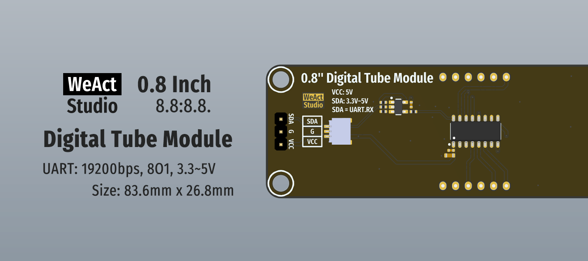

* [中文版本](./README_zh.md)
# WeActStudio.DigitalTubeModule


0.8 Inch 8.8:8.8. Module  
1. Size: 83.6mm x 26.8mm
2. Interface: Serial port, baud rate 19200bps, 8O1, 3.3~5V
3. Driver chip: TM1652
4. Display specification: 8 segments x 4 grids

Connector   
> sh1.0mm 1x3P

|Dir Name|Explain|
| :--:|:--:|
|Doc|DataSheet/ReferenceManual|
|Hardware|Hardware Development Kit|
|Examples|Software Examples|

```
/*---------------------------------------
- WeAct Studio Official Link
- taobao: weactstudio.taobao.com
- aliexpress: weactstudio.aliexpress.com
- github: github.com/WeActStudio
- gitee: gitee.com/WeAct-TC
- blog: www.weact-tc.cn
---------------------------------------*/
```