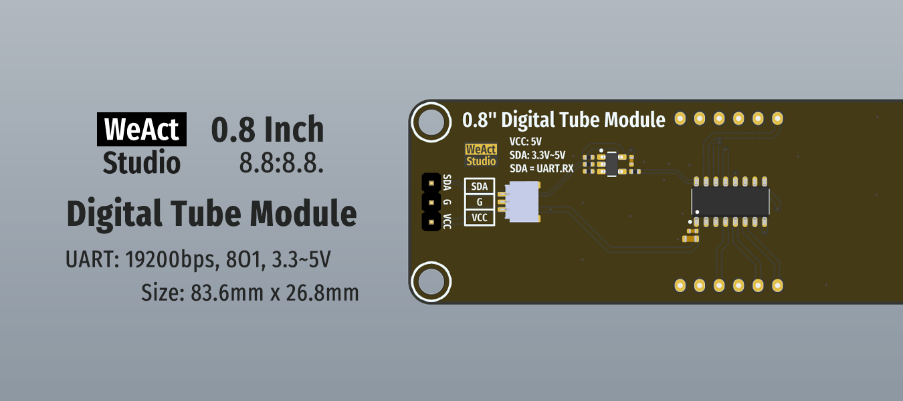

* [English version](./README.md)
# WeActStudio.DigitalTubeModule


0.8 Inch 8.8:8.8. Module  
1. 尺寸：83.6mm x 26.8mm
2. 接口：串口，波特率19200bps，8O1，3.3~5V
3. 驱动芯片：TM1652
4. 显示规格：8段x4位

连接器  
> sh1.0mm 1x3P

|目录名称|内容|
| :--:|:--:|
|Doc| 数据手册/参考手册|
|Hardware| 硬件开发资料|
|Examples|软件例程|

```
/*---------------------------------------
- WeAct Studio Official Link
- taobao: weactstudio.taobao.com
- aliexpress: weactstudio.aliexpress.com
- github: github.com/WeActStudio
- gitee: gitee.com/WeAct-TC
- blog: www.weact-tc.cn
---------------------------------------*/
```